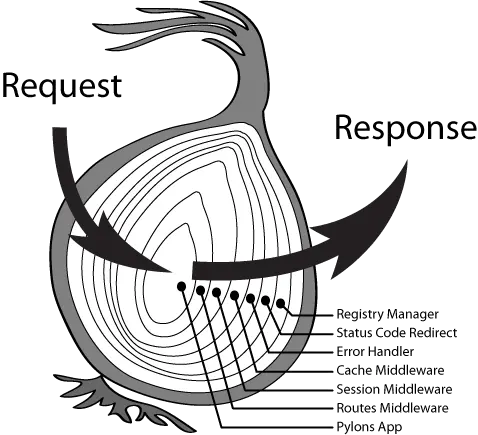

先来看下洋葱中间件机制，这种灵活的中间件机制也让 `koa` 变得非常强大。



## 查看示例

[查看示例](https://github.com/haiweilian/laboratory/tree/master/NodeJs/koa-simple-imp)

## 初始化项目

先来看一个使用 `node` 创建一个服务。

```js
let http = require("http");
let server = http.createServer((req, res) => {
  res.writeHead(200);
  res.end("hello world");
});
server.listen(3000, () => {
  console.log("listenning on 3000");
});
```

使用 `koa` 创建一个服务。 其实 `koa` 内部也是用的原生的 `http` 模块。

```js
const Koa = require("koa");
const app = new Koa();

app.use(async ctx => {
  ctx.body = "Hello World";
});

app.listen(3000);
```

## 基础实现

#### 四大模块

文档上也是很简单，只有 `Application`、`Context` 、`Request` 、`Response` 四部分。

- `Application` 是暴露出来的构造函数，有 `listen`、`use` 等等。

- `Context` 对象是 `koa` 的应用上下文。

- `Request` 对象是在 node 的 原生请求对象之上的抽象。

- `Response` 对象是在 node 的原生响应对象之上的抽象。

#### 封装 Application

将原生请求封装在类内部中。

```js
const http = require("http");
class Koa {
  constructor() {
    this.middlewares = []; // 中间件集合
  }

  // 创建服务，内部调用 http.createServer 方法。
  listen(...args) {
    const server = http.createServer(async (req, res) => {
      // ...
    });

    server.listen(...args);
  }
}
module.exports = Koa;
```

#### 封装 Context、Request、Response

就是对原生的 `request`、`response` 使用 `setter` 和 `getter` 进行了一个功能的封装，方便开发者调用。

- 封装 `request.js`，简单的几个。

```js
module.exports = {
  get url() {
    return this.req.url;
  },
  get method() {
    return this.req.method.toLowerCase();
  }
};
```

- 封装 `response.js`，简单的几个。

```js
module.exports = {
  get body() {
    return this._body;
  },
  set body(val) {
    this._body = val;
  }
};
```

- 封装 `context.js`，简单的几个。

```js
module.exports = {
  get url() {
    return this.request.url;
  },
  get body() {
    return this.response.body;
  },
  set body(val) {
    this.response.body = val;
  },
  get method() {
    return this.request.method;
  }
};
```

- 最后在构造函数里创建上下文。

```js
const http = require("http");
const context = require("./context");
const request = require("./request");
const response = require("./response");

class Koa {
  constructor() {}

  // 创建服务，内部调用 http.createServer 方法。
  listen(...args) {
    const server = http.createServer(async (req, res) => {
      // 创建上下文
      const ctx = this.createContext(req, res);
      // 返回结果
      res.end(ctx.body);
    });

    server.listen(...args);
  }

  // 创建上下文，一下各种赋值是为了使用方便。
  createContext(req, res) {
    const ctx = Object.create(context);

    // Koa 抽象 request/response 的对象。
    ctx.request = Object.create(request);
    ctx.response = Object.create(response);

    // Node 的 request/response 对象。
    ctx.req = ctx.request.req = req;
    ctx.res = ctx.response.res = res;

    return ctx;
  }
}

module.exports = Koa;
```

## 中间件实现

#### 洋葱圈模型

添加中间件是通过 `use` 添加，这其实是一个收集的过程。重点是通过 `compose` 函数，相比较 `redux` 的实现方式容易理解的多。

```js
class Koa {
  constructor() {
    this.middlewares = []; // 中间件集合
  }

  // 创建服务，内部调用 http.createServer 方法。
  listen(...args) {
    const server = http.createServer(async (req, res) => {
      // 创建上下文
      const ctx = this.createContext(req, res);

      // 组合中间件
      const compose = this.compose(this.middlewares);
      await compose(ctx);

      // 返回结果
      res.end(ctx.body);
    });

    server.listen(...args);
  }

  // 收集中间件，存到一个集合中。
  use(middleware) {
    this.middlewares.push(middleware);
  }

  // 中间件组合，本质上就是一个嵌套的高阶函数，外层的中间件嵌套着内层的中间件。
  // 有点像递归的机制，一层嵌套一层。调用 next 之前是 "递"，之后是 "归"。
  compose(middlewares) {
    return function(ctx) {
      // 从下标为 0 开始执行中间件。
      dispatch(0);
      function dispatch(i) {
        // 找出数组中存放的相应的中间件
        const middleware = middlewares[i];

        // 不存在返回成功，最后一个中间件调用 next 也不会报错。
        if (!middleware) {
          return Promise.resolve();
        }
        return Promise.resolve(
          middleware(
            // 第一个参数是 ctx。
            ctx,
            // 第二个参数是 next，允许继续进入下一个中间件。
            function next() {
              return dispatch(i + 1);
            }
          )
        );
      }
    };
  }
}
```

#### 测试中间件

以下应该输出 `1->2->3->4->5->6` 的顺序。

```js
app.use(async (ctx, next) => {
  console.log(1);
  await next();
  console.log(6);
});
app.use(async (ctx, next) => {
  console.log(2);
  await next();
  console.log(5);
});
app.use(async (ctx, next) => {
  console.log(3);
  await next();
  console.log(4);
});
```

#### 路由中间件

例如路由是如下定义使用。

```js
router.get("/get", (ctx, next) => {
  ctx.body = "get";
});
router.get("/post", (ctx, next) => {
  ctx.body = "post";
});
app.use(router.routes());
```

实现的过程就是注册路由信息，当接收到请求的时候，匹配路径执行对应的中间件。

```js
class Router {
  constructor() {
    this.stack = [];
  }

  // 注册路由信息，收集到一个集合中。
  register(path, methods, middleware) {
    let route = { path, methods, middleware };
    this.stack.push(route);
  }

  // get 请求。
  get(path, middleware) {
    this.register(path, "get", middleware);
  }

  // post 请求。
  post(path, middleware) {
    this.register(path, "post", middleware);
  }

  // 暴露出一个总的路由中间件。
  routes() {
    let stock = this.stack;

    return async function(ctx, next) {
      let currentPath = ctx.url;
      let route;

      // 根据 path 和 method 匹配对应对应的路由
      for (let i = 0; i < stock.length; i++) {
        let item = stock[i];
        if (currentPath === item.path && item.methods.indexOf(ctx.method) >= 0) {
          route = item.middleware;
          break;
        }
      }

      // 执行对应的函数，返回结果。
      if (typeof route === "function") {
        route(ctx, next);
        return;
      }

      await next();
    };
  }
}

module.exports = Router;
```
