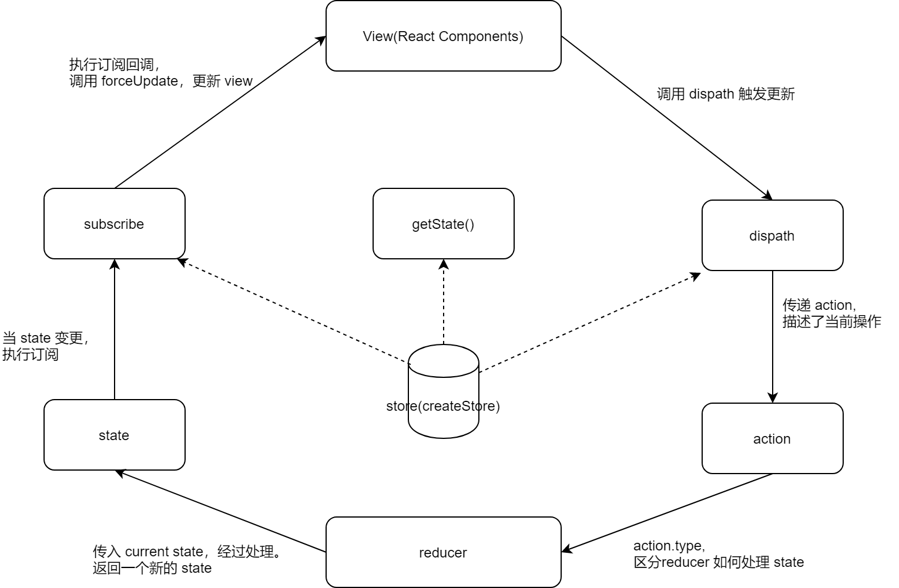

先来看下 redux 数据流。



## 查看示例

[查看示例](https://github.com/haiweilian/laboratory/tree/master/React/redux-simple-imp)

## 初始化项目

实现一个简单的记数器功能。

```js
// store/index.js
import { createStore, combineReducers } from "redux";

// reducer 接受一个 state，更具 action 返回新的 state 。
const countReducer = (state = 0, { type, payload = 1 }) => {
  console.log("2、reducer---处理state");
  switch (type) {
    case "ADD":
      return state + payload;
    case "MINUS":
      return state - payload;
    default:
      return state;
  }
};

const store = createStore(combineReducers({ count: countReducer }));

export default store;
```

```jsx
//src/pages/ReduxPage.js
import React, { Component } from "react";
import store from "../store/index";

export default class ReduxPage extends Component {
  componentDidMount() {
    // 添加订阅，当 state 更新的时候执行回调更新
    this.unsubscribe = store.subscribe(() => {
      console.log("3、subscribe-更新");
      this.forceUpdate();
    });
  }

  componentWillUnmount() {
    // 组件卸载时删除订阅
    this.unsubscribe && this.unsubscribe();
  }

  add = () => {
    // 触发更新执行，传递 action
    console.log("1、action---加");
    store.dispatch({
      type: "ADD",
    });
  };

  minus = () => {
    // 触发更新执行, 传递 action
    console.log("1、action---减");
    store.dispatch({
      type: "MINUS",
    });
  };

  render() {
    return (
      <div>
        <h3>ReduxPage</h3>
        <p>{store.getState().count}</p>
        <button onClick={this.add}>add</button>
        <button onClick={this.minus}>minus</button>
      </div>
    );
  }
}
```

## 核心实现

### 需求分析

- createStore

`createStore` 创建一个 `state`，并返回 `getState` `dispatch` `subscribe` 方法。

- combineReducers

`combineReducers` 合并多个 `reducer`。

### 实现 createStore

在执行 `createStore` 函数的时候，需要实现几个功能。

- 定义 `currentState` 变量存储当前的值。
- 实现 `getState` 获取当前的 `currentState`。
- 实现 `dispatch` 提交 `action` 并执行对应的 `reducer`，获取最新的值赋值给 `currentState` 并执行订阅。
- 实现 `subscribe` 添加订阅并返回取消订阅的函数。

```js
export default function createStore(reducer) {
  let currentState;
  let currentListeners = [];

  // 获取当前的 state
  function getState() {
    return currentState;
  }

  // 提交 action 执行 reducer
  function dispatch(action) {
    currentState = reducer(currentState, action);
    currentListeners.forEach((listener) => listener());
    return action;
  }

  // 添加订阅
  function subscribe(listener) {
    currentListeners.push(listener);
    // 返回用于取消订阅的方法
    return () => {
      const index = currentListeners.indexOf(listener);
      currentListeners.splice(index, 1);
    };
  }

  // 默认执行一次，触发下默认值
  dispatch({ type: "REUDX/DEFAULT" });

  return {
    getState,
    dispatch,
    subscribe,
  };
}
```

### 实现 combineReducers

它的实现方式就是，把多个 `reducer` 一块执行，然后把结果存储到一个对象里，整体返回。那么我们的取值方式就变成了 `store.getState().xxx` 了。

```js
// 合成 reducer 把 多个 reducer 的执行结果，合并成一个对象整体返回
export default function combineReducers(reducers) {
  return function combination(state = {}, action) {
    let nextState = {};

    for (let key in reducers) {
      const reducer = reducers[key];
      nextState[key] = reducer(state[key], action);
    }

    return nextState;
  };
}
```
